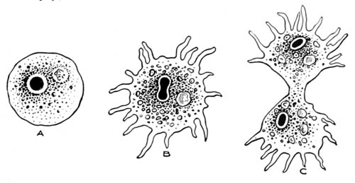

# Mathematical preliminaries {#math}

In this chapter we get a few mathematical preliminaries out of the way that are important for later chapters. If you feel rusty on any of these then please read up on them elsewhere.

## Logarithm and exponentiation

The following is inspired by @gelman2002. Suppose you have an amoeba that takes one hour to divide (Figure \@ref(fig:amoeba)), and then the two amoebas each divide in one more hour, and so forth. What is the equation of the number of amoebas, $y$, as a function of time, $t$ (in hours)?

```{r amoeba, echo=FALSE, fig.align='center', fig.cap='Amoeba dividing. Source: http://www.gutenberg.org/files/18451/18451-h/images/illus002.jpg.', out.width='80%'}

```

The equation is:
$$\begin{equation}
y=2^t
(\#eq:exp)
\end{equation}$$
This is an **exponential function** with **base** 2 and **exponent** $t$. Figure \@ref(fig:explog) shows two plots of this function. (Don't worry, you will start to understand the R code better as you progress in the PC labs.)

```{r explog, echo=TRUE, fig.align='center', fig.cap='Left: Plot of Equation 2.1. Right: Plot of Equation 2.1 on logarithmic scale.', fig.show='hold', out.width='50%'}
t <- seq(1, 6)
y <- 2^t
plot(t, y, pch = 19, type = 'b')
plot(t, log(y), pch = 19, type = 'b')
```

The inverse of the exponential function is the **logarithmic function**:
$$\begin{equation}
log(y)=log(2^t)=t \cdot log(2)
(\#eq:inv)
\end{equation}$$
Since the logarithm of $y$ is a linear function of $t$ (Equation \@ref(eq:inv)), the right-hand side of Figure \@ref(fig:explog) ($y$ on logarithmic scale) displays a straight line.

Common bases of the logarithmic function are:
$$\begin{equation}
log_2\left(2^t\right)=lb\left(2^t\right)=t
(\#eq:lb)
\end{equation}$$
This is called the binary logarithm (lb).

$$\begin{equation}
log_{10}\left(10^t\right)=lg\left(10^t\right)=t
(\#eq:lg)
\end{equation}$$
This is called the common logarithm (lg).

$$\begin{equation}
log_e\left(e^t\right)=ln\left(e^t\right)=t
(\#eq:ln)
\end{equation}$$
This is called the natural logarithm (ln) with $e \approx 2.7183$ being Euler's constant.

Note, programming often uses a different notation, which will also be used from now on in this course:
$$\begin{equation}
ln()=log()
(\#eq:lnlog)
\end{equation}$$
$$\begin{equation}
e^t=\exp(t)
(\#eq:eexp)
\end{equation}$$

Basic rules for exponentiation are:
$$\begin{equation}
a^m \cdot a^n=a^{m+n}
(\#eq:exprule1)
\end{equation}$$
$$\begin{equation}
a^n \cdot b^n=(a \cdot b)^n
(\#eq:exprule2)
\end{equation}$$
$$\begin{equation}
\frac{a^m}{a^n}=a^{m-n}
(\#eq:exprule3)
\end{equation}$$
$$\begin{equation}
\frac{a^n}{b^n}=\left(\frac{a}{b}\right)^n
(\#eq:exprule4)
\end{equation}$$
$$\begin{equation}
\left(a^m\right)^n=a^{m \cdot n}
(\#eq:exprule5)
\end{equation}$$

At this point it is also useful to remind ourselves of the meaning of the sum and product symbols:
$$\begin{equation}
\sum_{i=1}^{n}x_i=x_1+x_2+\ldots+x_n
(\#eq:sum)
\end{equation}$$
This signifies the **sum** of all $x_i$ for $i$ taking integer values from 1 to $n$.
$$\begin{equation}
\prod_{i=1}^{n}x_i=x_1 \cdot x_2 \cdot \ldots \cdot x_n
(\#eq:prod)
\end{equation}$$
This signifies the **product** of all $x_i$ for $i$ taking integer values from 1 to $n$.

The basic rules of logarithm are:
$$\begin{equation}
log(u \cdot v)=log(u)+log(v)
(\#eq:logrule1)
\end{equation}$$
$$\begin{equation}
log\left(\frac{u}{v}\right)=log(u)-log(v)
(\#eq:logrule2)
\end{equation}$$
$$\begin{equation}
log\left(u^r\right)=r \cdot log(u)
(\#eq:logrule3)
\end{equation}$$

## Centring and standardisation

Centring and standardisation are used to transform different datasets onto the same scale. We will need this for the multivariate methods in later sessions (Chapter \@ref(multivariate)).

**Centring** means subtracting from every data point $y$ the overall mean of the dataset $\bar{y}$:
$$\begin{equation}
y^*=y-\bar{y}
(\#eq:centring)
\end{equation}$$
This yields new data points $y^*$ and a new mean $\bar{y^*}=0$ while the standard deviation of the transformed data remains the same: $s_{y^*}=s_y$. Centring thus *shifts* the data histogram to be centred on zero, but does not change its shape (Figure \@ref(fig:rawcentred)).

```{r rawcentred, echo=TRUE, fig.align='center', fig.cap='Histogram of dataset $y$ (left) and centred dataset $y^*$ (right). The vertical line represents the mean.', fig.show='hold', out.width='50%'}
# draw random sample of size 1000 from normal distribution with mean 1 and standard deviation 2, i.e. y~N(1,2)
y <- rnorm(1000, mean = 1, sd = 2)
# mean
ybar <- mean(y)
# standard deviation
s_y <- sd(y)
# histogram, raw
hist(y, freq = FALSE, xlim = c(-10,10), ylim = c(0, 0.4), main = "", 
     xlab = "y", ylab = "relative frequency")
lines(c(ybar, ybar), c(0,0.4), lwd = 3)
# histogram, centred
hist(y-ybar, freq = FALSE, xlim = c(-10,10), ylim = c(0, 0.4), main = "", 
     xlab = "y*", ylab = "relative frequency")
lines(c(0, 0), c(0,0.4), lwd = 3)
```

**Standardisation** means subtracting from every data point $y$ the overall mean of the dataset $\bar{y}$ and additionally dividing by the standard deviation $s_y$:
$$\begin{equation}
y^*=\frac{y-\bar{y}}{s_y}
(\#eq:standardisation)
\end{equation}$$
This yields new data points $y^*$, a new mean $\bar{y^*}=0$ and a new standard deviation $s_{y^*}=1$. Standardisation thus shifts the data histogram to be centred on zero and expands or contracts it to have unit standard deviation (Figure \@ref(fig:rawstandardised)).

```{r rawstandardised, echo=TRUE, fig.align='center', fig.cap='Histogram of dataset $y$ (left) and standardised dataset $y^*$ (right). The vertical line represents the mean.', fig.show='hold', out.width='50%'}
# histogram, raw
hist(y, freq = FALSE, xlim = c(-10,10), ylim = c(0, 0.4), main = "", 
     xlab = "y", ylab = "relative frequency")
lines(c(ybar, ybar), c(0,0.4), lwd = 3)
# histogram, standardised
hist((y-ybar)/s_y, freq = FALSE, xlim = c(-10,10), ylim = c(0, 0.4), main = "", 
     xlab = "y*", ylab = "relative frequency")
lines(c(0, 0), c(0,0.4), lwd = 3)
```

If the original data $y$ were normally distributed (like we set it up for the plots above) then standardisation would transform $y$ to the scale of the standard normal distribution, i.e. a normal distribution with mean 0 and standard deviation 1. If you feel rusty on the normal distribution (or probability distributions in general) then Wikipedia is as good a source as any: https://en.wikipedia.org/wiki/Normal_distribution.

## Derivatives

The **first derivative** of a function $f(x)$, written as $f'(x)$ or $\frac{df(x)}{dx}$, can be interpreted graphically as the slope of that function, i.e. the tangent line of a certain point of the function (Figure \@ref(fig:derivative), left).

```{r derivative, echo=FALSE, fig.align='center', fig.cap='Left: Tangent line of function $f(x)$. Centre: Secant line of function $f(x)$ between point $f\\left(x_0\\right)$ and point $f\\left(x_0+h\\right)$; the horizontal distance between these two points is $\\Delta x$ and the vertical distance is $\\Delta f(x)$. Right: Set of secant lines of function $f(x)$ between point $f\\left(x_0\\right)$ and point $f\\left(x_0+h\\right)$ for progressively decreasing increments $h$. Source: https://en.wikipedia.org/wiki/Derivative.', fig.show='hold', out.width='33%'}
knitr::include_graphics(c('figs/derivative1.png','figs/derivative2.png','figs/derivative3.png'))
```

Mathematically, the slope amounts to the limiting value of the ratio of the (vertical) increment of the function, $\Delta f(x)$, for an (horizontal) increment of $x$, $\Delta x$, for $\Delta x$ approaching zero, $\Delta x \to 0$:
$$\begin{equation}
f'(x)=\frac{df(x)}{dx}=\lim_{\Delta x \to 0}\frac{\Delta f(x)}{\Delta x}
(\#eq:derivative1)
\end{equation}$$

This can be visualised as a secant line of the function between two points, $x_0$ and $x_0+h$ (Figure \@ref(fig:derivative), centre), whose slope is:
$$\begin{equation}
\frac{\Delta f(x)}{\Delta x}=\frac{f\left(x_0+h\right)-f\left(x_0\right)}{\left(x_0+h\right)-\left(x_0\right)}=\frac{f\left(x_0+h\right)-f\left(x_0\right)}{h}
(\#eq:derivative2)
\end{equation}$$

As $h$ approaches zero (Figure \@ref(fig:derivative), right) we reach the limiting value of the slope at point $x_0$, which is the first derivative:
$$\begin{equation}
\frac{df(x)}{dx}=\lim_{h \to 0}\frac{f\left(x_0+h\right)-f\left(x_0\right)}{h}
(\#eq:derivative3)
\end{equation}$$

The first derivative is useful for finding **minima**, **maxima** and **inflexion points** of a function, because this is where the slope is zero, $\frac{df(x)}{dx}=0$ (Figure \@ref(fig:minmax)). The **second derivative**, measuring the curvature of the function, tells us whether these points are minima $\left(\frac{d^2f(x)}{dx^2}>0\right)$, maxima $\left(\frac{d^2f(x)}{dx^2}<0\right)$ or inflexion points $\left(\frac{d^2f(x)}{dx^2}=0\right)$, but often we already know that a function has only a single minimum or maximum and then we do not need the second derivative.

```{r minmax, echo=FALSE, fig.align='center', fig.cap='Use of first and second derivative to determine minima, maxima and inflexion points of a function. Source: http://hyperphysics.phy-astr.gsu.edu/hbase/math/maxmin.html.', out.width='80%'}
knitr::include_graphics('figs/derivative4.gif')
```

The differentiation rules are listed below:

If $y=f(t)=t^a$ then $\frac{dy}{dt}=a \cdot t^{a-1}$, i.e. multiplying the function with the exponent and reducing the exponent by one gives you the derivative of $f(x)$.

Constant factor rule: If $y=c \cdot u(t)$ then $\frac{dy}{dt}=c \cdot \frac{du}{dt}$.

Sum rule: If $y=u(t) \pm v(t)$ then $\frac{dy}{dt}=\frac{du}{dt} \pm \frac{dv}{dt}$.

Product rule: If $y=u(t) \cdot v(t)$ then $\frac{dy}{dt}=\frac{du}{dt} \cdot v+u \cdot \frac{dv}{dt}$.

Quotient rule: If $y=\frac{u(t)}{v(t)}$  then $\frac{dy}{dt}=\frac{\left(\frac{du}{dt} \cdot v-u \cdot \frac{dv}{dt}\right)}{v^2}$.

Chain rule: If $y=f[g(t)]$ then $\frac{dy}{dt}=\frac{df[g]}{dg} \cdot \frac{dg}{dt}$, i.e. “outer times inner derivative”.

## Matrix algebra

The following is based on @tabachnick2013.

### Simple matrix operations

Let $\mathbf{A}$ and $\mathbf{B}$ be matrices:

$$\mathbf{A} =
\begin{pmatrix}
a & b & c\\
d & e & f\\
g & h & i
\end{pmatrix} =
\begin{pmatrix}
3 & 2 & 4\\
7 & 5 & 0\\
1 & 0 & 8
\end{pmatrix}
$$

$$\mathbf{B} =
\begin{pmatrix}
r & s & t\\
u & v & w\\
x & y & z
\end{pmatrix} =
\begin{pmatrix}
6 & 1 & 0\\
2 & 8 & 7\\
3 & 4 & 5
\end{pmatrix}
$$

**Addition/subtraction of a constant to a matrix** happens element-wise:

$$\mathbf{A} + k =
\begin{pmatrix}
a+k & b+k & c+k\\
d+k & e+k & f+k\\
g+k & h+k & i+k
\end{pmatrix}
$$

$$\mathbf{A} - k =
\begin{pmatrix}
a-k & b-k & c-k\\
d-k & e-k & f-k\\
g-k & h-k & i-k
\end{pmatrix}
$$

**Multiplication/division of a matrix by a constant** also happens element-wise:

$$k \cdot \mathbf{A} =
\begin{pmatrix}
k \cdot a & k \cdot b & k \cdot c\\
k \cdot d & k \cdot e & k \cdot f\\
k \cdot g & k \cdot h & k \cdot i
\end{pmatrix}
$$

$$\frac{1}{k} \cdot \mathbf{A} =
\begin{pmatrix}
\frac{1}{k} \cdot a & \frac{1}{k} \cdot b & \frac{1}{k} \cdot c\\
\frac{1}{k} \cdot d & \frac{1}{k} \cdot e & \frac{1}{k} \cdot f\\
\frac{1}{k} \cdot g & \frac{1}{k} \cdot h & \frac{1}{k} \cdot i
\end{pmatrix}
$$

**Addition/subtraction of two matrices** happens element-wise again:

$$\mathbf{A} + \mathbf{B} =
\begin{pmatrix}
a+r & b+s & c+t\\
d+u & e+v & f+w\\
g+x & h+y & i+z
\end{pmatrix}
$$

$$\mathbf{A} - \mathbf{B} =
\begin{pmatrix}
a-r & b-s & c-t\\
d-u & e-v & f-w\\
g-x & h-y & i-z
\end{pmatrix}
$$

Finally, the so called **transpose of a matrix** refers to the mirroring of a matrix along its diagonal. Hence, the transpose of $\mathbf{A}$ is:

$$\mathbf{A}' =
\begin{pmatrix}
a & d & g\\
b & e & h\\
c & f & i
\end{pmatrix}
$$

### Matrix multiplication

Now, the multiplication of two matrices is the only operation that is a bit complicated at first. It may be best to consider an example to work out the rules:

$$\begin{eqnarray}
\mathbf{A} \cdot \mathbf{B}&=&
\begin{pmatrix}
a & b & c\\
d & e & f\\
g & h & i
\end{pmatrix} \cdot
\begin{pmatrix}
r & s & t\\
u & v & w\\
x & y & z
\end{pmatrix}\\
&=&\begin{pmatrix}
a \cdot r + b \cdot u + c \cdot x & a \cdot s + b \cdot v + c \cdot y & a \cdot t + b \cdot w + c \cdot z\\
d \cdot r + e \cdot u + f \cdot x & d \cdot s + e \cdot v + f \cdot y & d \cdot t + e \cdot w + f \cdot z\\
g \cdot r + h \cdot u + i \cdot x & g \cdot s + h \cdot v + i \cdot y & g \cdot t + h \cdot w + i \cdot z
\end{pmatrix}\\
&=&\begin{pmatrix}
34 & 35 & 34\\
52 & 47 & 35\\
30 & 33 & 40
\end{pmatrix}
\end{eqnarray}$$

The result of a matrix multiplication has as many *rows* as the 1st matrix and as many *columns* as the 2nd. For this to work, the number of columns of the 1st matrix must match the number of rows of the 2nd matrix. In our example, this does not matter as the matrices are square, i.e. they have as many rows as columns.

To construct each cell of the results matrix, one row of the 1st matrix is combined with one column of the 2nd matrix. For cell (1,1) (top-left), for example, we combine the 1st row of matrix 1 (here $\mathbf{A}$) and the 1st column of matrix 2 (here $\mathbf{B}$). Moving to the right, for cell (1,2) (top-middle), we combine the 1st row of matrix 1 and the 2nd column of matrix 2. For cell (2,1) (middle-left), we combine the 2nd row of matrix 1 and the 1st column of matrix 2. And so on and so forth.

The combination of the two respective vectors is the sum of the products of the vector elements paired in order. So for cell (1,1) in our example this is $a \cdot r + b \cdot u + c \cdot x$. Try and recreate the following example to get a feeling for the matrix multiplication rules.

$$\begin{eqnarray}
\mathbf{B} \cdot \mathbf{A}&=&
\begin{pmatrix}
r & s & t\\
u & v & w\\
x & y & z
\end{pmatrix} \cdot
\begin{pmatrix}
a & b & c\\
d & e & f\\
g & h & i
\end{pmatrix}\\
&=&\begin{pmatrix}
r \cdot a + s \cdot d + t \cdot g & r \cdot b + s \cdot e + t \cdot h & r \cdot c + s \cdot f + t \cdot i\\
u \cdot a + v \cdot d + w \cdot g & u \cdot b + v \cdot e + w \cdot h & u \cdot c + v \cdot f + w \cdot i\\
x \cdot a + y \cdot d + z \cdot g & x \cdot b + y \cdot e + z \cdot h & x \cdot c + y \cdot f + z \cdot i
\end{pmatrix}\\
&=&\begin{pmatrix}
25 & 17 & 24\\
69 & 44 & 64\\
42 & 26 & 52
\end{pmatrix}
\end{eqnarray}$$

The point with this example is that $\mathbf{A} \cdot \mathbf{B}$ is not the same as $\mathbf{B} \cdot \mathbf{A}$. The order matters when multiplying matrices! Let's consider two more example:

$$\begin{eqnarray}
\mathbf{A} \cdot \mathbf{A}&=&
\begin{pmatrix}
a & b & c\\
d & e & f\\
g & h & i
\end{pmatrix} \cdot
\begin{pmatrix}
a & b & c\\
d & e & f\\
g & h & i
\end{pmatrix}\\
&=&\begin{pmatrix}
a^2 + b \cdot d + c \cdot g & a \cdot b + b \cdot e + c \cdot h & a \cdot c + b \cdot f + c \cdot i\\
d \cdot a + e \cdot d + f \cdot g & d \cdot b + e^2 + f \cdot h & d \cdot c + e \cdot f + f \cdot i\\
g \cdot a + h \cdot d + i \cdot g & g \cdot b + h \cdot e + i \cdot h & g \cdot c + h \cdot f + i^2
\end{pmatrix}\\
&=&\begin{pmatrix}
27 & 16 & 44\\
56 & 39 & 28\\
11 & 2 & 68
\end{pmatrix}
\end{eqnarray}$$

This matrix multiplied with itself, $\mathbf{A} \cdot \mathbf{A}$, is different to the same matrix multiplied with its transpose $\mathbf{A} \cdot \mathbf{A}'$:

$$\begin{eqnarray}
\mathbf{A} \cdot \mathbf{A}'&=&
\begin{pmatrix}
a & b & c\\
d & e & f\\
g & h & i
\end{pmatrix} \cdot
\begin{pmatrix}
a & d & g\\
b & e & h\\
c & f & i
\end{pmatrix}\\
&=&\begin{pmatrix}
a^2 + b^2 + c^2 & a \cdot d + b \cdot e + c \cdot f & a \cdot g + b \cdot h + c \cdot i\\
d \cdot a + e \cdot b + f \cdot c & d^2 + e^2 + f^2 & d \cdot g + e \cdot h + f \cdot i\\
g \cdot a + h \cdot b + i \cdot c & g \cdot d + h \cdot e + i \cdot f & g^2 + h^2 + i^2
\end{pmatrix}\\
&=&\begin{pmatrix}
29 & 31 & 35\\
31 & 74 & 7\\
35 & 7 & 65
\end{pmatrix}
\end{eqnarray}$$

This last matrix is symmetrical, i.e. mirrored along its diagonal. Diagonal elements are so called **sums of squares**, off-diagonal elements are so called **cross-products**. This will be useful later on when working with variance-covariance matrices in Chapter \@ref(multivariate).

### Matrix division, inverse of a matrix, identity matrix

**Division of two matrices** means multiplication of one matrix with the so called inverse of the other, here $\mathbf{B}^{-1}$:

$$\frac{\mathbf{A}}{\mathbf{B}} = \mathbf{A} \cdot \mathbf{B}^{-1}$$

The **inverse of a matrix** is different to the transpose. It is rather complicated to calculate, using in most cases numerical (and not analytical) techniques that we do not go into here. At the most general level, the inverse is found so that the following equation holds:

$$\mathbf{A} \cdot \mathbf{A}^{-1} = \mathbf{A}^{-1} \cdot \mathbf{A} = \mathbf{I}$$

With $\mathbf{I}$ being the **identity matrix**, i.e. a matrix with diagonal elements 1 and off-diagonal elements 0:

$$\mathbf{I} =
\begin{pmatrix}
1 & 0 & 0\\
0 & 1 & 0\\
0 & 0 & 1
\end{pmatrix}
$$

## Exercises

### Exercise 1 {-}

Apply the rules in the script to the following equation to get rid of the product operator, and then simplify the resultant equation as much as you can:

$$\begin{equation}
\prod_{i=1}^{n}\frac{1}{\sigma \cdot \sqrt{2 \cdot \pi}} \cdot \exp\left(\frac{\left(y_i - \beta_0 - \beta_1 \cdot x_i\right)^2}{-2 \cdot \sigma^2}\right)=
(\#eq:ex1)
\end{equation}$$

### Exercise 2 {-}

Apply the differentiation rules in the script to take the derivative of the following equation:

$$\begin{equation}
\frac{d\sum_{i=1}^{n}\left(y_i - \beta_0 - \beta_1 \cdot x_i\right)^2}{d\beta_0}=
(\#eq:ex2)
\end{equation}$$

### Exercise 3 {-}

Consider the following vectors and matrix: $y =
\begin{pmatrix}
y_1\\
y_2\\
y_3
\end{pmatrix}$, $\beta =
\begin{pmatrix}
\beta_0\\
\beta_1\\
\beta_2\\
\beta_3
\end{pmatrix}$, $\epsilon =
\begin{pmatrix}
\epsilon_1\\
\epsilon_2\\
\epsilon_3
\end{pmatrix}$ and $\mathbf{X} =
\begin{pmatrix}
1 & x_{11} & x_{12} & x_{13}\\
1 & x_{21} & x_{22} & x_{23}\\
1 & x_{31} & x_{32} & x_{33}
\end{pmatrix}$.

Now solve the following equation using matrix algebra:

$$y = \mathbf{X} \cdot \beta + \epsilon = $$
