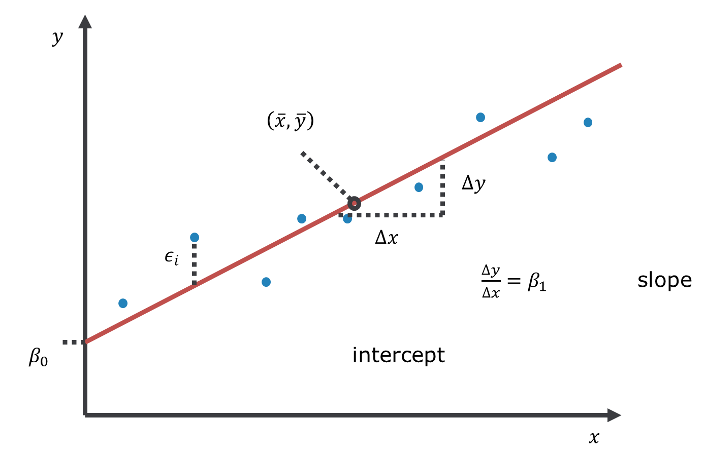
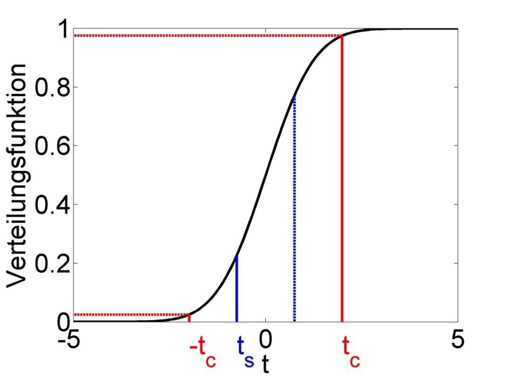

# Linear regression {#lin_reg}

## Motivation

The questions we wish to answer with linear regression are of the kind depicted in Figure \@ref(fig:motivation): What drives spatial variation in annual average precipitation and annual average temperature? In the case of precipitation the drivers seem to be continentality and elevation, while temperature appears to be dominantly controlled by elevation only. Linear regression examines this question by modelling a response variable against one or more predictor variables, while the relationship between the two is linear in its parameters.

## The linear model

The most general from of a **linear model** is:

$$\begin{equation}
y = \beta_0 + \sum_{j=1}^{p}\beta_j \cdot x_j + \epsilon
(\#eq:linmod)
\end{equation}$$
In this equation, $y$ is the **response variable** (also called dependent or output variable), $x_j$ are the **predictor variables** (also called independent, explanatory, input variables or covariates), $\beta_0, \beta_1, \ldots, \beta_p$ are the **parameters** and $\epsilon$ is the **residual**, i.e. that part of the response which remains unexplained by the predictors.

In the case of one predictor, which has come to be known as **linear regression**, the linear model is:

$$\begin{equation}
y = \beta_0 + \beta_1 \cdot x + \epsilon
(\#eq:linmodsingle)
\end{equation}$$
It can be visualised as a line, with $\beta_0$ being the **intercept**, where the line intersects the vertical axis $(x=0)$, and $\beta_1$ being the **slope** of the line (Figure \@ref(fig:linreggraph)). Note, the point $\left(\bar{x},\bar{y}\right)$, the centroid of the data, always lies on the line.

```{r linreggraph, echo=FALSE, fig.align='center', fig.cap='Linear model with one predictor variable (linear regression).', out.width='80%'}

```

Linear means linear in terms of the model parameters, not (necessarily) in terms of the predictor variables. With this in mind, consider the following five models. Which are linear models, which are non-linear models? (Q1)^[The answer can be found at the end of this script.]

$$\begin{equation}
y = \beta_0 + \beta_1 \cdot x_1 + \beta_2 \cdot x_2 + \epsilon
(\#eq:Q1model1)
\end{equation}$$
$$\begin{equation}
y = \beta_0 + \beta_1 \cdot x_1^{\beta_2} + \epsilon
(\#eq:Q1model2)
\end{equation}$$
$$\begin{equation}
y = \beta_0 + \beta_1 \cdot x_1^3 + \beta_2 \cdot x_1 \cdot x_2 + \epsilon
(\#eq:Q1model3)
\end{equation}$$
$$\begin{equation}
y = \beta_0 + \exp(\beta_1 \cdot x_1) + \beta_2 \cdot x_2 + \epsilon
(\#eq:Q1model4)
\end{equation}$$
$$\begin{equation}
y = \beta_0 + \beta_1 \cdot \log x_1 + \beta_2 \cdot x_2 + \epsilon
(\#eq:Q1model5)
\end{equation}$$

We can also write the linear model equation with the data points explicitly indexed by $i$ for $i=1, 2, \ldots, n$. We have omitted the index previously for ease of reading:

$$\begin{equation}
y_i = \beta_0 + \sum_{j=1}^{p}\beta_j \cdot x_{ij} + \epsilon_i
(\#eq:linmodi)
\end{equation}$$
These data points could be repeat measurements in time or in space.

We can also write the model more compactly in a matrix format:

$$\begin{equation}
y = \mathbf{X} \cdot \beta + \epsilon
(\#eq:linmodmatrix)
\end{equation}$$

With $y =
\begin{pmatrix}
y_1\\
y_2\\
y_3
\end{pmatrix}$, $\beta =
\begin{pmatrix}
\beta_0\\
\beta_1\\
\beta_2\\
\beta_3
\end{pmatrix}$, $\epsilon =
\begin{pmatrix}
\epsilon_1\\
\epsilon_2\\
\epsilon_3
\end{pmatrix}$ and $\mathbf{X} =
\begin{pmatrix}
1 & x_{11} & x_{12} & x_{13}\\
1 & x_{21} & x_{22} & x_{23}\\
1 & x_{31} & x_{32} & x_{33}
\end{pmatrix}$, the latter being the **design matrix** which summarises the predictor data.

When we talk about the linear model, the response variable is always continuous, while the predictor variables can be continuous, categorical or mixed. In principle, each of these variants can be treated mathematically in the same way, e.g. all can be analysed using the `lm()` function in R. However, historically different names have been established for these variants, which are worth mentioning here to avoid confusion (Tables \@ref(tab:variants1) and \@ref(tab:variants2)).

| Continuous<br>predictors | Categorical<br>predictors | Mixed<br>predictors |
| :---: | :---: | :---: |
| Regression | Analysis of variance<br>(ANOVA) | Analysis of covariance<br>(ANCOVA) |
Table: (\#tab:variants1) Historical names for the variants of the linear model, depending on whether the predictors are continuous, categorical or mixed. The response is always continuous.

| | 1 predictor variable  | >1 predictor variables |
| :---: | :---: | :---: |
| **1 response variable** | Regression  | Multiple regression |
| **>1 response variables** | Multivariate regression | Multivariate multiple regression |
Table: (\#tab:variants2) Historical names for the regression, depending on whether we have one or more predictors and one or more responses.

## Description versus prediction

The primary purpose of regression analysis is the description (or explanation) of the data in terms of a general relationship pertaining to the population that these data are sampled from. Being a property of the population, this relationship should then also allow us to make predictions, but we need to be careful. Consider the relationship between year and world record time for the men's mile depicted in Figure \@ref(fig:mile). When the predictor is time, as shown here, regression becomes a form of trend analysis, in this case of how the record time in the male competition decreased over the years. We will talk about the R code and output further below, here we're just interested in the linear predictions.

```{r echo=TRUE}
# load mile data from remote repository
dat <- read.csv("https://raw.githubusercontent.com/avehtari/ROS-Examples/master/Mile/data/mile.csv", header=TRUE)
# fit linear model to data from 1st half of 20th century
fit1 <- lm(seconds ~ year, data = dat[dat$year<1950,])
# extract information about parameter estimates
coef(summary(fit1))
# fit linear model to complete dataset
fit2 <- lm(seconds ~ year, data = dat)
coef(summary(fit2))
```

```{r mile, echo=TRUE, fig.align='center', fig.cap='Left: Trend of the world record for the men`s mile over the first half of the 20th century (description). Centre: Extrapolation of this trend over the 2nd half of the 20th century (prediction). Right: Extrapolation of the overall trend until the year 2050 (longer prediction). After: @wainer2009', fig.show='hold', out.width='33%'}
# plot fit for 1st half of 20th century
plot(dat$year[dat$year<1950], dat$seconds[dat$year<1950],
     xlim = c(1900, 2000), ylim = c(200, 260),
     pch = 19, type = 'p',
     xlab = "Year", ylab = "World record, men's mile (seconds)")
abline(coef(fit1), lwd = 3, col = "red")
# plot extrapolation to 2nd half of 20th century
plot(dat$year, dat$seconds,
     xlim = c(1900, 2000), ylim = c(200, 260),
     pch = 19, type = 'p',
     xlab = "Year", ylab = "World record, men's mile (seconds)")
abline(coef(fit1), lwd = 3, col = "red")
# plot all-data fit until 2050
plot(dat$year, dat$seconds,
     xlim = c(1900, 2050), ylim = c(200, 260),
     pch = 19, type = 'p',
     xlab = "Year", ylab = "World record, men's mile (seconds)")
abline(coef(fit2), lwd = 3, col = "red")
```

The world record for the men`s mile improved linearly over the first half of the 20th century (Figure \@ref(fig:mile), left). This trend provides a remarkably accurate fit for the second half of the century as well (Figure \@ref(fig:mile), centre). However, for how long can the world record continue to improve at the same rate (Figure \@ref(fig:mile), right)? This example clearly shows that the scope for prediction by regression lies within certain bounds, while highlighting the limits of these simple models for making distant predictions (e.g. in time and space). In the case of the world record we would expect the rate of improvement to decline with time, i.e. the world record to level off, which calls for a non-linear model.

## Linear Regression

Typically, regression problems are solved, i.e. the lines in Figures \@ref(fig:linreggraph) and \@ref(fig:mile) are fitted to the data, by minimising the Sum of Squared Errors (SSE) between the regression line and the data points. This method has become known as **Least Squares**. Graphically, it means that in Figure \@ref(fig:linreggraph) we try different lines with different intercepts $\left(\beta_0\right)$ and slopes $\left(\beta_1\right)$ and ultimately choose the one where the sum over all vertical distances $\epsilon_i$ squared is smallest. Mathematically, SSE is defined as:

$$\begin{equation}
SSE=\sum_{i=1}^{n}\left(\epsilon_i\right)^2=\sum_{i=1}^{n}\left(y_i-\left(\beta_0+\beta_1 \cdot x_i\right)\right)^2
(\#eq:sse)
\end{equation}$$
The terms $\epsilon_i=y_i-\left(\beta_0+\beta_1 \cdot x_i\right)$ are called the **residuals**, i.e. that part of the variation in the data which the linear model cannot explain.

In the case of linear regression, SSE can be minimised analytically, which is not the case for non-linear models, for example. Analytically, we find the minimum of SSE where its partial derivatives with respect to the two model parameters are both zero (compare Chapter \@ref(math)): $\frac{\partial SSE}{\partial \beta_0}=0$ and $\frac{\partial SSE}{\partial \beta_1}=0$. Using the definition of SEE of Equation \@ref(eq:sse) we thus begin with a system of two differential equations:

$$\begin{equation}
\frac{\partial SSE}{\partial \beta_0}=-2 \cdot \sum_{i=1}^{n}\left(y_i-\beta_0-\beta_1 \cdot x_i\right)=0
(\#eq:sseb0)
\end{equation}$$
$$\begin{equation}
\frac{\partial SSE}{\partial \beta_1}=-2 \cdot \sum_{i=1}^{n}x_i \cdot \left(y_i-\beta_0-\beta_1 \cdot x_i\right)=0
(\#eq:sseb1)
\end{equation}$$
We have already calculated these derivatives in an exercise in Chapter \@ref(math) using the sum rule and the chain rule in particular. Since Equations \@ref(eq:sseb0) and \@ref(eq:sseb1) form a system of two differential equations with two unknowns ($\beta_0$ and $\beta_1$; the data points $x_i$ and $y_i$ are known) we can solve it exactly.

First, we solve Equation \@ref(eq:sseb0) for $\beta_0$ (after dividing by -2):

$$\begin{equation}
\sum_{i=1}^{n}y_i-n \cdot \beta_0-\beta_1 \cdot \sum_{i=1}^{n}x_i=0
(\#eq:b01)
\end{equation}$$
$$\begin{equation}
n \cdot \hat\beta_0=\sum_{i=1}^{n}y_i-\hat\beta_1 \cdot \sum_{i=1}^{n}x_i
(\#eq:b02)
\end{equation}$$
$$\begin{equation}
\hat\beta_0=\bar{y}-\hat\beta_1 \cdot \bar{x}
(\#eq:b03)
\end{equation}$$
Note, at some point we have renamed $\beta_0$ to $\hat\beta_0$ and $\beta_1$ to $\hat\beta_1$ to denote these as **estimates**. The parameter notation up to now has been general but as we approach actual numerical values for the data at hand we are using the "hat" symbol to signify that we are now calculating estimates of those general parameters for a given dataset.

Second, we insert Equation \@ref(eq:b03) into Equation \@ref(eq:sseb1) (again after dividing by -2 and rearranging):

$$\begin{equation}
\sum_{i=1}^{n}\left(x_i \cdot y_i-\beta_0 \cdot x_i-\beta_1 \cdot x_i^2\right)=0
(\#eq:insert1)
\end{equation}$$
$$\begin{equation}
\sum_{i=1}^{n}\left(x_i \cdot y_i-\bar{y} \cdot x_i+\hat\beta_1 \cdot \bar{x} \cdot x_i-\hat\beta_1 \cdot x_i^2\right)=0
(\#eq:insert2)
\end{equation}$$

Third, we solve Equation \@ref(eq:insert2) for $\beta_1$:

$$\begin{equation}
\sum_{i=1}^{n}\left(x_i \cdot y_i-\bar{y} \cdot x_i\right)-\hat\beta_1 \cdot \sum_{i=1}^{n}\left(x_i^2-\bar{x} \cdot x_i\right)=0
(\#eq:b11)
\end{equation}$$
$$\begin{equation}
\hat\beta_1=\frac{\sum_{i=1}^{n}\left(x_i \cdot y_i-\bar{y} \cdot x_i\right)}{\sum_{i=1}^{n}\left(x_i^2-\bar{x} \cdot x_i\right)}
(\#eq:b12)
\end{equation}$$

Via a series of steps that I skip here, we arrive at:

$$\begin{equation}
\hat\beta_1=\frac{SSXY}{SSX}
(\#eq:b13)
\end{equation}$$
Where $SSX=\sum_{i=1}^{n}\left(x_i-\bar{x}\right)^2$ and $SSXY=\sum_{i=1}^{n}\left(x_i-\bar{x}\right) \cdot \left(y_i-\bar{y}\right)$. Note, analogously $SSY=\sum_{i=1}^{n}\left(y_i-\bar{y}\right)^2$. Equation \@ref(eq:b13) is an exact solution for $\hat\beta_1$.

We then insert Equation \@ref(eq:b13) back into Equation \@ref(eq:sse) and have an exact solution for $\hat\beta_0$.

## Significance of regression

Having estimates for the regression parameters we need to ask ourselves whether these estimates are statistically significant or could have arisen by chance from the (assumed) random process of sampling the data. We do this via **Analysis of Variance (ANOVA)**, which begins by constructing the ANOVA table (Table \@ref(tab:anova)). This is often done in the background in software like R and not actually looked at that much.

| Source | Sum of<br>squares | Degrees of freedom $(df)$ | Mean squares | F statistic $\left(F_s\right)$ | $\Pr\left(Z\geq F_s\right)$ |
| :---: | :---: | :---: | :---: | :---: | :---: |
| Regression | $SSR=\\SSY-SSE$ | $1$ | $\frac{SSR}{df_{SSR}}$ | $\frac{\frac{SSR}{df_{SSR}}}{s^2}$ | $1-F\left(F_s,1,n-2\right)$ |
| Error | $SSE$ | $n-2$ | $\frac{SSE}{df_{SSE}}=s^2$ | | |
| Total | $SSY$ | $n-1$ | | | |
Table: (\#tab:anova) ANOVA table for linear regression.

In the second column of Table \@ref(tab:anova), $SSY=\sum_{i=1}^{n}\left(y_i-\bar{y}\right)^2$ is a measure of the total variance of the data, i.e. how much the data points are varying around the overall mean (Figure \@ref(fig:ssysse), left). $SSE=\sum_{i=1}^{n}\left(\epsilon_i\right)^2=\sum_{i=1}^{n}\left(y_i-\left(\beta_0+\beta_1 \cdot x_i\right)\right)^2$ is a measure of the error variance, i.e. how much the data points are varying around the regression line (Figure \@ref(fig:ssysse), right). This is the variance not explained by the model. $SSR=SSY-SSE$ then is a measure of the variance explained by the model.

```{r ssysse, echo=FALSE, fig.align='center', fig.cap='Variation of the data points around the mean, summarised by $SSY$ (left), and around the regression line, summarised by $SSE$ (right).', fig.show='hold', out.width='50%'}
knitr::include_graphics(c('figs/ssy.jpg','figs/sse.jpg'))
```

The third column of Table \@ref(tab:anova) lists the so called **degrees of freedom** of the three variance terms, which can be understood as the number of free parameters for the respective term that is controlled by the (assumed) random process of sampling the data. It is the number of possibilities for the chance process to unfold. $SSY$ requires one parameter $\left(\bar{y}\right)$ to be calculated from the data (see above). Hence the degrees of freedom are $n-1$; if I know $\bar{y}$ then there are $n-1$ data points left that can be generated by chance, the nth one I can calculate from all the others and $\bar{y}$. $SSE$, in turn, requires two parameters ($\beta_0$ and $\beta_1$) to be calculated from the data (Equations \@ref(eq:b03) and \@ref(eq:b13)). Hence the degrees of freedom are $n-2$. The degrees of freedom of $SSR$ then are just the difference between the former two; $df_{SSR}=df_{SSY}-df_{SSE}=1$. The degrees of freedom are used to normalise the variance terms in the fourth column of Table \@ref(tab:anova), where $s^2$ is called the **error variance**.

In the fifth column of Table \@ref(tab:anova) we find the ratio of two variances; regression variance over error variance. Naturally, for a significant regression we want the regression variance (explained by the model) to be much larger than the error variance (unexplained by the model). This is an **F-Test** problem, testing whether the variance explained by the model is significantly different from the variance unexplained by the model. The ratio of the two variances serves as the F statistic $\left(F_s\right)$. The sixth column of Table \@ref(tab:anova) then shows the **p-value** of the F-Test, i.e. the probability of getting $F_s$ or a larger value (i.e. an even better model) by chance if the Null hypothesis $\left(H_0\right)$) is true. $H_0$ here is that the two variances are equal. It can be shown mathematically that $F_s$ follows an F-distribution with parameters $1$ and $n-2$ under the Null hypothesis (Figure \@ref(fig:fcdf)). The red line in Figure \@ref(fig:fcdf) marks a particular value of $F_s$ (between 10 and 11) and the corresponding value of the cumulative distribution function of the F-distribution $\left(F\left(F_s,1,n-2\right)\right)$. The p-value is $\Pr\left(Z\geq F_s\right)=1-F\left(F_s,1,n-2\right)$, i.e. the probability of getting this variance ratio or a greater one by chance (due to the random sampling process) even if the two variances are actually equal. Here this value is very small and hence we conclude that the regression is significant.

```{r fcdf, echo=FALSE, fig.align='center', fig.cap='Cumulative distribution function (CDF) of the F-distribution of the F statistic $\\left(F_s\\right)$, with a particular value and corresponding value of the CDF marked in red.', out.width='80%'}
knitr::include_graphics('figs/cdf_f.jpg')
```

The correct interpretation of the p-value is a bit tricky. In the words of philosopher of science Ian @hacking2001, if we have a p-value of say 0.01 this means "either the Null hypothesis is true, in which case something unusual happened by chance (probability 1%), or the Null hypothesis is false." This means, strictly speaking, the p-value is not the probability of the Null hypothesis being true; it is the probability of the data to come about if the Null hypothesis were true. If this is a very low probability then we think this tells us something about the Null hypothesis (that perhaps we should reject it), but in a roundabout way. Note, in the case of linear regression, the Null model is $\beta_1=0$, i.e. $y=\beta_0$ with $\hat\beta_0=\bar{y}$, which means the overall mean is the best model summarising the data (Figure \@ref(fig:ssysse), left).

## Confidence in parameter estimates

Having established the statistical significance of the regression, we should look at the uncertainty around the parameter estimates. In classic linear regression this uncertainty is conceptualised as arising purely from the random sampling process; the data at hand are just one possibility of many, and in each alternative case the parameter estimates would have turned out slightly different. The linear model itself is assumed to be correct.

The first step in establishing how confident we should be that the parameter estimates are correct is the calculation of **standard errors**. For $\hat\beta_0$ this is (derivation not shown here):

$$\begin{equation}
s_{\hat\beta_0}=\sqrt{\frac{\sum_{i=1}^{n}x_i^2}{n} \cdot \frac{s^2}{SSX}}
(\#eq:seb0)
\end{equation}$$
Breaking down this formula into its individual parts, we can see that the more data points $n$ we have, the smaller the standard error, i.e. the more confidence we have in the estimate. Also, the larger the variation in $x$ $(SSX)$ the smaller the standard error. Both effects make intuitive sense: the more data points we have and the more possibilities for $x$ we have covered, the more we can be confident that we have not missed much in our random sample. Conversely, the larger the error variance $s^2$, i.e. the smaller the explanatory power of our model, the larger the standard error. And, the more $x$ data points we have away from zero, i.e. the greater $\sum_{i=1}^{n}x_i^2$, the smaller our confidence in the intercept (where $x=0$) and hence the standard error increases.

The standard error for $\hat\beta_1$ is:

$$\begin{equation}
s_{\hat\beta_1}=\sqrt{\frac{s^2}{SSX}}
(\#eq:seb1)
\end{equation}$$
The same interpretation applies, except there is no influence of the magnitude of the $x$ data points.

We can also establish a standard error for new predictions $\hat y$ for given new predictor values $\hat x$:

$$\begin{equation}
s_{\hat y}=\sqrt{s^2 \cdot \left(\frac{1}{n}+\frac{\left(\hat x-\bar x\right)^2}{SSX}\right)}
(\#eq:sey)
\end{equation}$$
The same interpretation applies again, except there now is an added term $\left(\hat x-\bar x\right)^2$ which means the further the new $x$ value is away from the centre of the original data (the training or calibration data) the greater the standard error of the new prediction, i.e. the lower the confidence in it being correct. Note, the formulae for the standard errors arise from the fundamental assumptions of linear regression, which will be covered below. This can be shown mathematically but is omitted here.

From the standard errors we can calculate **confidence intervals** for the parameter estimates as follows:

$$\begin{equation}
\Pr\left(\hat\beta_0-t_{n-2;0.975} \cdot s_{\hat\beta_0}\leq \beta_0\leq \hat\beta_0+t_{n-2;0.975} \cdot s_{\hat\beta_0}\right)=0.95
(\#eq:cib01)
\end{equation}$$
The symbol $\Pr(\cdot)$ means probability. The symbol $t_{n-2;0.975}$ stands for the 0.975-percentile of the t-distribution with $n-2$ degrees of freedom. Equation \@ref(eq:cib01) is the central 95% confidence interval, which is defined as the bounds in which the true parameter, here $\beta_0$, lies with a probability of 0.95. We can write the interval like this:

$$\begin{equation}
CI=\left[\hat\beta_0-t_{n-2;0.975} \cdot s_{\hat\beta_0};\hat\beta_0+t_{n-2;0.975} \cdot s_{\hat\beta_0}\right]
(\#eq:cib02)
\end{equation}$$
As can be seen, the confidence interval $CI$ is symmetric around the parameter estimate $\hat\beta_0$ and arises from a t-distribution with parameter $n-2$ whose width is modulated by the standard error $s_{\hat\beta_0}$. Note, the width of the t-distribution is also controlled by sample size, becoming narrower with increasing $n$.

The same formulae apply for $\beta_1$ and $y$:

$$\begin{equation}
\Pr\left(\hat\beta_1-t_{n-2;0.975} \cdot s_{\hat\beta_1}\leq \beta_1\leq \hat\beta_1+t_{n-2;0.975} \cdot s_{\hat\beta_1}\right)=0.95
(\#eq:cib1)
\end{equation}$$
$$\begin{equation}
\Pr\left(\hat y-t_{n-2;0.975} \cdot s_{\hat y}\leq y\leq \hat y+t_{n-2;0.975} \cdot s_{\hat y}\right)=0.95
(\#eq:ciy)
\end{equation}$$
As with the p-values, we need to be clear about the meaning of probability here, which in classic statistics is predicated on the **repeated sampling principle**. The meaning of the 95% confidence interval then is that in an assumed infinite number of regression experiments the 95% confidence interval captures the true parameter value in 95% of the cases. Again, this is not a probability of the true parameter value lying within the confidence interval for any one experiment!

The formulae for the confidence intervals (Equations \@ref(eq:cib01), \@ref(eq:cib1) and \@ref(eq:ciy)) arise from the fundamental assumptions of linear regression; the residuals are **independent identically distributed (iid)** according to a **normal distribution** and **the linear model is correct**. Then it can be shown mathematically that $\frac{\hat\beta_0-\beta_0}{s_{\hat\beta_0}}$, $\frac{\hat\beta_1-\beta_1}{s_{\hat\beta_1}}$ and $\frac{\hat y-y}{s_{\hat y}}$ are $t_{n-2}$-distributed (t-distribution with $n-2$ degrees of freedom). Since the central 95% confidence interval of an arbitrary $t_{n-2}$-distributed random variable $Z$ is $\Pr\left(-t_{n-2;0.975}\leq Z\leq t_{n-2;0.975}\right)=0.95$ (Figure \@ref(fig:tpdfcdf)), we can substitute any of the aforementioned three terms for $Z$ and rearrange to arrive at Equations \@ref(eq:cib01), \@ref(eq:cib1) and \@ref(eq:ciy).

```{r tpdfcdf, echo=FALSE, fig.align='center', fig.cap='Left: Probability density function (PDF) of a t-distributed random variable $Z$, with central 95% confidence interval marked in red. 95% of the PDF lies between the two bounds, 2.5% lies left of the lower bound and 2.5% right of the upper bound. Right: Cumulative distribution function (CDF) of the same t-distributed random variable $Z$. The upper bound of the 95% confidence interval is defined as $t_{n-2;0.975}$, i.e. the 0.975-percentile of the distribution, while the lower bound is defined as $t_{n-2;0.025}$, which is equivalent to $-t_{n-2;0.975}$ due to the symmetry of the distribution.', fig.show='hold', out.width='50%'}
knitr::include_graphics(c('figs/pdf_t.jpg','figs/cdf_t.jpg'))
```

The t-distribution property of the parameter estimates can further be exploited to test each parameter estimate separately for its statistical significance. This becomes especially important for multiple regression problems where we have more than one possible predictor, not all of which will have a statistically significant effect. The **significance of the parameter estimates** is determined via a **t-test**. The Null hypothesis is that the true parameters are zero, i.e. the parameter estimates are not significant:

$$\begin{equation}
H_0:\beta_0=0
(\#eq:h0b0)
\end{equation}$$
$$\begin{equation}
H_0:\beta_1=0
(\#eq:h0b1)
\end{equation}$$

This hypothesis is tested against the alternative hypothesis that the true parameters are different from zero, i.e. the parameter estimates are significant:

$$\begin{equation}
H_1:\beta_0\neq 0
(\#eq:h1b0)
\end{equation}$$
$$\begin{equation}
H_1:\beta_1\neq 0
(\#eq:h1b1)
\end{equation}$$

The test statistics are:

$$\begin{equation}
t_s=\frac{\hat\beta_0-0}{s_{\hat\beta_0}}\sim t_{n-2}
(\#eq:tsb0)
\end{equation}$$
$$\begin{equation}
t_s=\frac{\hat\beta_1-0}{s_{\hat\beta_1}}\sim t_{n-2}
(\#eq:tsb1)
\end{equation}$$
The “tilde” symbol $(\sim)$ means the test statistics follow a certain distribution, here the t-distribution. This arises again from the regression assumptions noted above. The assumptions are the same as for the common t-test of means, except in the case of linear regression the residuals are assumed iid normal while in the case of means the actual data points $y$ are assumed iid normal.

Analogous to the common 2-sided t-test, the p-value is defined as:

$$\begin{equation}
2 \cdot \Pr\left(t>|t_s|\right)=2 \cdot \left(1-F_t\left(|t_s|\right)\right)
(\#eq:pv)
\end{equation}$$
The symbol $F_t\left(|t_s|\right)$ signifies the value of the CDF of the t-distribution at the location of the absolute value of the test statistic ($|t_s|$, Figure \@ref(fig:tc)). With a significance level of say $\alpha=0.05$ we arrive at critical values of the test statistic $t_c=t_{n-2;0.975}$ and $-t_c$ beyond which we reject the Null hypothesis and call the parameter estimates significant (Figure \@ref(fig:tc)).

```{r tc, echo=FALSE, fig.align='center', fig.cap='Schematic of the t-test of significance of parameter estimates. The test statistic follows a t-distribution under the Null hypothesis. The actual value of the test statistic $t_s$ is marked in blue and mirrored at zero for the 2-sided test. The critical value of the test statistic $t_c$, which we get from a significance level of $\\alpha=0.05$, is marked in red; this too is mirrored for the 2-sided test. We reject the Null hypothesis if $|t_s|>t_c$, i.e. for values of $t_s$ below $-t_c$ and above $t_c$, and then call this parameter estimate significant. We keep the Null hypothesis if $|t_s|\\leq t_c$, i.e. for values of $t_s$ between $-t_c$ and $t_c$, and then call this parameter estimate insignificant (for now). In the example shown the parameter estimate is insignificant.', out.width='80%'}

```

## Goodness of fit

The final step in regression analysis is assessing the goodness of fit of the linear model. In the first instance this may be done through the **coefficient of determination** $\left(r^2\right)$, which is defined as the proportion of variation (in y-direction) that is explained by the model:

$$\begin{equation}
r^2=\frac{SSY-SSE}{SSY}=1-\frac{SSE}{SSY}
(\#eq:r2)
\end{equation}$$
As can be seen, when the model fails to explain more variation than the total variation around the mean, i.e. $SSE=SSY$, then $r^2=0$. Conversely, when the model fits the data perfectly, i.e. $SSE=0$, then $r^2=1$. Any value in between signifies varying levels of goodness of fit. This can be visualised again with Figure \@ref(fig:ssysse), with the left panel signifying $SSY$ and the right panel $SSE$.

When it comes to comparing models of varying complexity (i.e. with more or less parameters) using $r^2$, then penalising the metric by the number of model parameters makes sense since more complex models (more parameters) automatically lead to better fits, simply due to the greater degrees of freedom that more complex models have for fitting the data. This leads to the **adjusted $r^2$**:

$$\begin{equation}
\bar r^2=1-\frac{\frac{SSE}{df_{SSE}}}{\frac{SSY}{df_{SSY}}}=1-\frac{SSE}{SSY} \cdot \frac{df_{SSY}}{df_{SSE}}
(\#eq:adjr2)
\end{equation}$$

The coefficient of determination alone, however, is insufficient for assessing goodness of fit. Consider the four datasets depicted in Figure \@ref(fig:anscomberaw), which together form the @anscombe1973 dataset.

```{r anscomberaw, echo=TRUE, fig.align='center', fig.cap='The four @anscombe1973 datasets.', fig.show='hold', out.width='50%'}
# load Anscombe dataset
dat <- anscombe
# plot 4 individual datasets
plot(dat$x1, dat$y1, xlim = c(0, 20), ylim = c(0, 14), pch = 19, type = 'p')
plot(dat$x2, dat$y2, xlim = c(0, 20), ylim = c(0, 14), pch = 19, type = 'p')
plot(dat$x3, dat$y3, xlim = c(0, 20), ylim = c(0, 14), pch = 19, type = 'p')
plot(dat$x4, dat$y4, xlim = c(0, 20), ylim = c(0, 14), pch = 19, type = 'p')
```

The individual datasets have purposely been constructed to yield virtually the same parameter estimates and coefficients of determination, despite wildly different relationships between $x$ and $y$ (Figure \@ref(fig:anscombefit)):

```{r echo=TRUE}
# perform individual regressions
fit1 <- lm(y1 ~ x1, data = dat)
fit2 <- lm(y2 ~ x2, data = dat)
fit3 <- lm(y3 ~ x3, data = dat)
fit4 <- lm(y4 ~ x4, data = dat)
# extract information about parameter estimates and R2
coef(summary(fit1))
summary(fit1)$r.squared
coef(summary(fit2))
summary(fit2)$r.squared
coef(summary(fit3))
summary(fit3)$r.squared
coef(summary(fit4))
summary(fit4)$r.squared
```

In these summary tables, "(Intercept)" stands for $\beta_0$, while "x1" to "x4" stand for $\beta_1$. The column "Estimate" gives $\hat\beta_0$ and $\hat\beta_1$, the column "Std. Error" gives $s_{\hat\beta_0}$ and $s_{\hat\beta_1}$, the column "t value" gives the individual $t_s$ and the column "Pr(>|t|)" gives the respective p-value.

```{r anscombefit, echo=TRUE, fig.align='center', fig.cap='Regression analysis of the four @anscombe1973 datasets, yielding virtually the same parameter estimates and coefficients of determination (see above), despite wildly different relationships between $x$ and $y$.', fig.show='hold', out.width='50%'}
# plot individual datasets with regression lines
plot(dat$x1, dat$y1, xlim = c(0, 20), ylim = c(0, 14), pch = 19, type = 'p')
abline(coef(fit1), lwd = 3, col = "red")
plot(dat$x2, dat$y2, xlim = c(0, 20), ylim = c(0, 14), pch = 19, type = 'p')
abline(coef(fit2), lwd = 3, col = "red")
plot(dat$x3, dat$y3, xlim = c(0, 20), ylim = c(0, 14), pch = 19, type = 'p')
abline(coef(fit3), lwd = 3, col = "red")
plot(dat$x4, dat$y4, xlim = c(0, 20), ylim = c(0, 14), pch = 19, type = 'p')
abline(coef(fit4), lwd = 3, col = "red")
```

The coefficient of determination is insensitive to these and similar systematic deviations from the regression line. But we can detect these deficiencies of the model by looking at plots like Figure \@ref(fig:anscombefit), and more generally by performing **residual diagnostics** that **check model assumptions**.

The fundamental assumptions of linear regression are:

- The residuals are **independent**, in which case there will be no serial correlation in the residual plot – this can be tested using the Durbin-Watson test
- The residuals are **normally distributed** – this can be visually assessed using the quantile-quantile plot (QQ plot) and the residual histogram, and can be tested using the Kolmogorov-Smirnov test and the Shapiro-Wilk test
- The variance is the same across residuals, i.e. residuals are **homoscedastic**, in which case there is no "fanning out" of the residuals

If these assumptions are not met then we can resort to data transformation, weighted regression or Generalised Linear Models (this is the preferred option), which we will cover in chapter \@ref(glms).

A first useful diagnostic plot is of the residuals in series, i.e. by index $i$, to see if there is a pattern due to the data collection process (Figure \@ref(fig:anscomberes1)). For the Anscombe dataset, this detects the nonlinearity in dataset 2 (top-right) and the outlier in dataset 3 (bottom-left), compare Figure \@ref(fig:anscombefit).

```{r anscomberes1, echo=TRUE, fig.align='center', fig.cap='@anscombe1973 datasets. Plot of residuals in series, i.e. by index $i$.', fig.show='hold', out.width='50%'}
# plot residuals against index
plot(residuals(fit1), xlim = c(0, 12), ylim = c(-2, 2), pch = 19, type = 'p')
abline(h = 0, lwd = 3, col = "red")
plot(residuals(fit2), xlim = c(0, 12), ylim = c(-2, 2), pch = 19, type = 'p')
abline(h = 0, lwd = 3, col = "red")
plot(residuals(fit3), xlim = c(0, 12), ylim = c(-2, 4), pch = 19, type = 'p')
abline(h = 0, lwd = 3, col = "red")
plot(residuals(fit4), xlim = c(0, 12), ylim = c(-2, 2), pch = 19, type = 'p')
abline(h = 0, lwd = 3, col = "red")
```

We should also plot the residuals by predicted value of $y$ to see if there is a pattern as a function of magnitude (Figure \@ref(fig:anscomberes2)). For the Anscombe dataset, this emphasizes the non-linearity of dataset 2 (top-right) and the outlier in dataset 3 (bottom-left) and also detects the singular extreme point in dataset 4 (bottom-right). In sum, the independence and homoscedasticity assumptions seem to be violated in all datasets except dataset 1. This would have to be formally tested using the Durbin-Watson test, for example.

```{r anscomberes2, echo=TRUE, fig.align='center', fig.cap='@anscombe1973 datasets. Plot of residuals by predicted value of $y$.', fig.show='hold', out.width='50%'}
# plot residuals against predicted value of y
plot(fitted.values(fit1),residuals(fit1), xlim = c(0, 14), ylim = c(-2, 2), pch = 19, type = 'p')
abline(h = 0, lwd = 3, col = "red")
plot(fitted.values(fit2),residuals(fit2), xlim = c(0, 14), ylim = c(-2, 2), pch = 19, type = 'p')
abline(h = 0, lwd = 3, col = "red")
plot(fitted.values(fit3),residuals(fit3), xlim = c(0, 14), ylim = c(-2, 4), pch = 19, type = 'p')
abline(h = 0, lwd = 3, col = "red")
plot(fitted.values(fit4),residuals(fit4), xlim = c(0, 14), ylim = c(-2, 2), pch = 19, type = 'p')
abline(h = 0, lwd = 3, col = "red")
```

The normality assumption can be assessed using the QQ plot (Figure \@ref(fig:anscombeqq)).

```{r anscombeqq, echo=TRUE, fig.align='center', fig.cap='@anscombe1973 datasets. Quantile-quantile plot (QQ plot) of residuals.', fig.show='hold', out.width='50%'}
# QQ plots
qqnorm(residuals(fit1), xlim = c(-4, 4), ylim = c(-4, 4))
qqline(residuals(fit1))
qqnorm(residuals(fit2), xlim = c(-4, 4), ylim = c(-4, 4))
qqline(residuals(fit2))
qqnorm(residuals(fit3), xlim = c(-4, 4), ylim = c(-4, 4))
qqline(residuals(fit3))
qqnorm(residuals(fit4), xlim = c(-4, 4), ylim = c(-4, 4))
qqline(residuals(fit4))
```

In the QQ plot, every data point represents a certain quantile of the empirical distribution. This quantile (after standardisation) is plotted (vertical axis) against the value of that quantile expected under a standard normal distribution (horizontal axis). The resultant shapes say something about the distribution of the residuals (Figure \@ref(fig:qq)), e.g. in case of a normal distribution they all fall on a straight line. In the Anscombe dataset, the only clearly non-normal dataset seems to be #3 (bottom-left). This would have to be formally tested using the Kolmogorov-Smirnov test or the Shapiro-Wilk test, for example.

```{r qq, echo=FALSE, fig.align='center', fig.cap='Characteristic shapes of the QQ plot and what they mean for the residuals in our case. Source: https://condor.depaul.edu/sjost/it223/documents/normal-plot.htm.', out.width='80%'}
knitr::include_graphics('figs/qq.gif')
```

The non-normality of dataset 3 becomes apparent also in the residual histograms (Figure \@ref(fig:anscomberes3)). They also emphasize the outlier in dataset 3. Note, it is generally difficult to reject the hypothesis of normally distributed residuals with so few data points.

```{r anscomberes3, echo=TRUE, fig.align='center', fig.cap='@anscombe1973 datasets. Quantile-quantile plot (QQ plot) of residuals.', fig.show='hold', out.width='50%'}
# histograms of residuals
hist(residuals(fit1), breaks = seq(-4,4,0.5))
hist(residuals(fit2), breaks = seq(-4,4,0.5))
hist(residuals(fit3), breaks = seq(-4,4,0.5))
hist(residuals(fit4), breaks = seq(-4,4,0.5))
```
