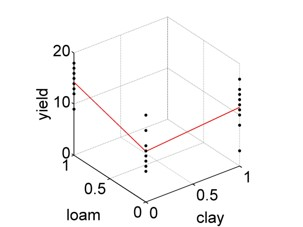

# Categorical predictors {#categoricalvars}

The linear model where the _predictor variables are categorical_ - so called **factors** - has come to be known as **Analysis of Variance (ANOVA)**. In this chapter we first introduce ANOVA in a classic sense before showing how this is essentially a special case of the linear model.

As an example we will look at a dataset of crop yields for different soil types from @crawley2012 - see Figure \@ref(fig:yields) - asking the question: _Does soil type significantly affect crop yield?_

```{r, setup, echo=FALSE, message=FALSE}
options(rgl.useNULL=TRUE)
library(rgl)
library(knitr)

```
```{r include = FALSE}
library(tidyverse)
```

```{r echo=TRUE}
# load yields data
yields <- read.table("data/yields.txt",header=T)
# means per soil type
mu_j <- sapply(list(yields$sand,yields$clay,yields$loam),mean)
# overall mean
mu <- mean(mu_j)
```
```{r yields, echo=TRUE, fig.align='center', fig.cap='Boxplots of yield per soil type (the factor) with individual and overall means marked in red. Data from: @crawley2012', out.width='80%'}
# boxplots of yield per soil type
boxplot(yields, ylim = c(0, 20), ylab = "yield")
abline(h = mu, lwd = 3, col = "red")
points(seq(1,3), mu_j, pch = 23, lwd = 3, col = "red")
```

The factor in this example is "soil type". The categories of a factor are called **levels**, **groups** or **treatments** depending on the experimental setting and the research field. In the yields example the factor levels are "sand", "clay" and "loam". The parameters of an ANOVA are called **effects** - more below. ANOVA with one factor is called **one-way ANOVA**.

The typical question answered by ANOVA is: Are _means_ across factor levels significantly different? This is tested by comparing the variation _between_ levels (i.e. the overlap or not between boxplots in Figure \@ref(fig:yields)) to the variation _within_ levels (i.e. the size of the individual boxplots). In the case of one factor with two levels, ANOVA is equivalent to the familiar t-test.

The Linear effects model formulation for ANOVA is:
$$\begin{equation}
y_{ji}=\mu+a_j+\epsilon_{ji}
(\#eq:effform)
\end{equation}$$
With $j=1, 2, \ldots, k$ indexing the levels (e.g. sand, clay, loam), $i=1, 2, \ldots, n_j$ indexing the data points at level $j$, $y_{ji}$ being the $i$th observation of the response variable (e.g. yield) at level $j$, $\mu$ being the overall mean of the response variable (Figure \@ref(fig:anovassysse), left), $\mu_j$ being the mean of the response variable at level $j$, $a_j=\mu_j-\mu$ being the effect of level $j$, and $\epsilon_{ji}$ being the residual error. So effectively the response variable for each level is predicted by its mean plus random noise (Figure \@ref(fig:anovassysse), right):
$$\begin{equation}
y_{ji}=\mu_j+\epsilon_{ji}
(\#eq:levform)
\end{equation}$$

```{r anovassysse, echo=FALSE, fig.align='center', fig.cap='Left: Variation of data points around overall mean $\\mu$, summarised by $SSY$. Right: Variation of data points around individual means $\\mu_1, \\mu_2, \\mu_3$, summarised by $SSE$.', fig.show='hold', out.width='50%'}


yields %>%
  pivot_longer(everything()) %>%
  mutate(mean = mean(value)) %>% 
  arrange(factor(name, levels = c("sand", "clay", "loam"))) %>%
  mutate(id = seq(1:30)) %>% 
  ggplot(aes(x = id, color = name)) +
  theme_classic() +
  geom_point(aes(y = value)) +
  geom_line(aes(y = mean), color = "black") +
  geom_linerange(aes(ymax = value, ymin = mean)) +
  ggtitle("SSY") +
  theme(plot.title = element_text(hjust = 0.5, size = 24),
        axis.text=element_text(size=14),
        axis.title=element_text(size=14)) +
  ylab("yield") +
  xlab("data point") +
  guides(color=FALSE) + 
  scale_color_manual(breaks = c("sand", "clay", "loam"),
                        values=c("green", "red", "blue")) +
  annotate('text', 31, 11.5, label="italic(mu)", parse=TRUE, size=7) 


yields %>%
  pivot_longer(everything()) %>%
  group_by(name) %>%
  mutate(mean = mean(value)) %>% 
  arrange(factor(name, levels = c("sand", "clay", "loam"))) %>%
  ungroup() %>% 
  mutate(id = seq(1:30)) %>% 
  ggplot(aes(x = id, color = name)) +
  theme_classic() +
  geom_point(aes(y = value)) +
  geom_line(aes(y = mean)) +
  geom_linerange(aes(ymax = value, ymin = mean)) +
  ggtitle("SSE") +
  theme(plot.title = element_text(hjust = 0.5, size = 24),
        axis.text=element_text(size=14),
        axis.title=element_text(size=14)) +
  ylab("yield") +
  xlab("data point") +
  guides(color=FALSE) + 
  scale_color_manual(breaks = c("sand", "clay", "loam"),
                        values=c("green", "red", "blue")) +
  annotate('text', 11, 9.5, label="italic(mu)[1]", parse=TRUE, size=7) +
  annotate('text', 21, 11, label="italic(mu)[2]", parse=TRUE, size=7) +
  annotate('text', 31, 13.5, label="italic(mu)[3]", parse=TRUE, size=7)
  
  
#knitr::include_graphics(c('figs/anova_ssy.png','figs/anova_sse.png'))
```

To see how the ANOVA model is essentially a linear model we look at what is called **dummy coding** of the categorical predictor (here soil type). This is the original data table:
```{r echo=TRUE}
yields
```

Now we expand this to a long table with dummy or **indicator variables** "clay" and "loam":
```{r echo=TRUE}
yields2 <- data.frame(yield = c(yields$sand, yields$clay, yields$loam),
                      clay = c(rep(0,10), rep(1,10), rep(0,10)),
                      loam = c(rep(0,10), rep(0,10), rep(1,10)))
yields2
```
When "clay" is 1 and "loam" is 0 then we are in the clay category, when "clay" is 0 and "loam" is
1 then we are in the loam category, and if both are 0 we are in the "sand" category. This is visualised in 3D in Figure
[4.3](\#yields3d).

```{r yields3d, echo=FALSE, fig.align='center', fig.cap='3D representation of the dummy coding of the yields dataset.', out.width='88%', webgl=TRUE}
#

knit_hooks$set(webgl = hook_webgl)


plot3d(x = yields2$clay, y = yields2$loam, z = yields2$yield, type="p", col="black", xlab="clay", ylab="loam", zlab="yield", lwd=15, size = 5)

x <- c(1,0,0)
y <- c(0,0,1)
z <- c(mean(yields$clay),mean(yields$sand),mean(yields$loam))

lines3d(x,y,z, col = "red")
```
Figure
[4.3](\#yields3d)

Now we can use the familiar linear model, but with two predictors, to represent ANOVA:
$$\begin{equation}
y_i=\beta_0+\beta_1\cdot x_{i1}+\beta_2\cdot x_{i2}+\epsilon_i
(\#eq:dummyanova)
\end{equation}$$
In this formulation, $x_1$ is the indicator variable "clay" and $x_2$ is the indicator variable "loam". Both can only take values of 0 and 1, they are binary. Hence, looking at Figure
[4.3](\#yields3d), when both $x_1$ and $x_2$ are 0 then we are in the front corner of the plot where we see the yield data for "sand". The model is then reduced to $y_i=\beta_0+\epsilon_i$, with $\beta_0$ being the mean yield for "sand".

When $x_1=0$ and $x_2=1$ then we are in the left corner of Figure
[4.3](\#yields3d) where we see the "loam" yields. The model is then $y_i=\beta_0+\beta_2+\epsilon_i$ with $\beta_0+\beta_2$ being the mean yield for "loam".

Finally, when $x_1=1$ and $x_2=0$ then we are in the right corner of Figure
[4.3](\#yields3d) where we see the "clay" yields. The model is then $y_i=\beta_0+\beta_1+\epsilon_i$ with $\beta_0+\beta_1$ being the mean yield for "clay". $\beta_1$ and $\beta_2$ are thus increments added to what's called the base category (in this case "sand") to arrive at the new means for "clay" and "loam", respectively. This is symbolised by the red lines in Figure
[4.3](\#yields3d). We are basically modelling unique means for each factor level; Equations \@ref(eq:dummyanova) and \@ref(eq:levform) are equivalent.

If you remember, we already looked at an ANOVA table under linear regression (chapter \@ref(linreg)). Let's now see how this is essentially similar to the actual ANOVA, while noting some key differences. Table \@ref(tab:oneway) shows the one-way ANOVA table.

| Source | Sum of<br>squares | Degrees of freedom $(df)$ | Mean squares | F statistic $\left(F_s\right)$ | $\Pr\left(Z\geq F_s\right)$ |
| :---: | :---: | :---: | :---: | :---: | :---: |
| Level | $SSA=\\SSY-SSE$ | $k-1$ | $\frac{SSA}{df_{SSA}}$ | $\frac{\frac{SSA}{df_{SSA}}}{s^2}$ | $1-F\left(F_s,1,n-k\right)$ |
| Error | $SSE$ | $n-k$ | $\frac{SSE}{df_{SSE}}=s^2$ | | |
| Total | $SSY$ | $n-1$ | | | |
Table: (\#tab:oneway) One-way ANOVA table.

Compare this to Table \@ref(tab:anova). The essential differences are: The explained variation is now labeled "level" with the notation $SSA$, instead of "regression" and $SSR$. The number of parameters subtracted from the data degrees of freedom is now $k$, the number of levels, instead of 2. The error variation is now calculated as $SSE=\sum_{j=1}^{k}\sum_{i=1}^{n_j}\left(y_{ji}-\bar y_j\right)^2$ (Figure \@ref(fig:anovassysse), right), instead of $SSE=\sum_{i=1}^{n}\left(y_i-\left(\beta_0+\beta_1\cdot x_i\right)\right)^2$. The total variation, however, is the same: $SSY=\sum_{j=1}^{k}\sum_{i=1}^{n_j}\left(y_{ji}-\bar y\right)^2=\sum_{i=1}^{n}\left(y_i-\bar y\right)^2$ (Figure \@ref(fig:anovassysse), left).

For comparison, a perfect model fit would look like Figure \@ref(fig:perfectssysse).
```{r perfectssysse, echo=FALSE, fig.align='center', fig.cap='Hypothetical perfect fit of an ANOVA model. Left: Variation of data points around overall mean, summarised by $SSY$. Right: Variation of data points around individual means, summarised by $SSE$.', fig.show='hold', out.width='50%'}
knitr::include_graphics(c('figs/perfect_ssy.jpg','figs/perfect_sse.jpg'))
```

When we estimate the individual means of the factor levels, they come with a **standard error** just like the linear regression parameters. This is:
$$\begin{equation}
s_{\mu_j}=\sqrt{\frac{s^2}{n_j}}
(\#eq:semuj)
\end{equation}$$
With $n_j$ being 10 in our example, which does not need to be the same across the factor levels, and $s^2=\frac{SSE}{n-k}$, the error variance from the ANOVA table (Table \@ref(tab:oneway)). Let's calculate the various means, effect sizes and corresponding errors again:
```{r echo=TRUE}
# define constants
n <- 30
k <- 3
n_j <- 10
# means per soil type
mu_j <- sapply(list(yields$sand,yields$clay,yields$loam),mean)
mu_j
# overall mean
mu <- mean(mu_j)
mu
# effect size
a_j <- mu_j - mu
a_j
# SSE
SSE <- sum(sapply(list(yields$sand,yields$clay,yields$loam),function (x) sum((x-mean(x))^2) ))
SSE
# error variance
s2 <- SSE/(n-k)
s2
# standard error of individual means
# here the same across factor levels as n_j is homogeneous
s_mu_j <- sqrt(s2/n_j)
s_mu_j
```

Finally, what we are really interested in are the differences between factor level means $\mu_j$ and whether they are statistically significant, i.e. large enough compared to the variation within each factor level. This is a t-test problem (comparing two means) for which we need the **differences of means**, let's call them $\Delta\mu_j$, and the standard errors of these differences:
$$\begin{equation}
s_{\Delta\mu_j}=\sqrt{\frac{2\cdot s^2}{n_j}}
(\#eq:sedelta)
\end{equation}$$

The t-test statistics then is:
$$\begin{equation}
t_s=\frac{\Delta\mu_j}{s_{\Delta\mu_j}}
(\#eq:ts)
\end{equation}$$

Compare the standard t-test where the test statistic is $t_s=\frac{\bar x_1-\bar x_2}{\sqrt{\frac{s_1^2}{n_1}+\frac{s_2^2}{n_2}}}$. Since in this dataset we have equal sample sizes across levels and homogeneous variance (homoscedasticity) is a fundamental assumption of ANOVA (as it is of linear regression), the standard t-test statistic simplifies to Equation \@ref(eq:ts).

The corresponding p-value of the 2-sided test then is:
$$\begin{equation}
\Pr\left(|Z|\geq t_s\right)=2\cdot\left(1-t\left(t_s,n'-2\right)\right)
(\#eq:pvalue)
\end{equation}$$
With $t\left(t_s,n'-2\right)$ being the value of the cumulative distribution function (cdf) of the t-distribution with parameter $n'-2$ at the location $t_s$, and $n'=20$ in the yields example.

Let's calculate these t-tests "by hand" in R:
```{r echo=TRUE}
# differences of means
delta_mu_j <- c(mu_j[2]-mu_j[1],mu_j[3]-mu_j[1],mu_j[3]-mu_j[2])
delta_mu_j
# standard error of differences
# here the same across factor levels as n_j is homogeneous
s_delta_mu_j <- sqrt(2*s2/n_j)
s_delta_mu_j
# t-test statistics
t_s <- delta_mu_j/s_delta_mu_j
t_s
# p-values
pvalue <- 2*(1-pt(t_s,20-2))
pvalue
```
We conclude that the yields on sand and loam are just about significantly different at a conventional significance level of 0.01, with yields on sand being 4.4 units lower on average. The other yield differences are not statistically significant (compare Figure \@ref(fig:yields)).
