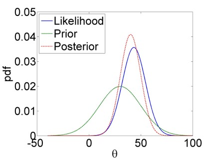

# Probabilistic underpinnings {#mlbayes}

In this chapter we will see how the assumptions of linear regression - which are needed for the quantification of uncertainty in our results - come about. We will first derive the Least Squares parameter estimators from Maximum Likelihood theory (the historically dominant approach) before giving an introduction to the more general approach of Bayesian statistics. The latter is the focus of my course _Applied Statistical Modelling_ in the summer term and also features at a basic level in _Risk and Uncertainty in Science and Policy_ in the winter term.

## Inference via Maximum Likelihood {#ml}

The so called **likelihood** of parameters conditional on some calibration data is defined as the probability of the data conditional on the parameters (and implicitly the model):
$$\begin{equation}
L(\boldsymbol{\theta}|\mathbf{y})=\Pr(\mathbf{y}|\boldsymbol{\theta})
(\#eq:lnorm1)
\end{equation}$$

$\boldsymbol{\theta}$ is a vector of parameters, in the case of linear regression $\boldsymbol{\theta}=\begin{pmatrix}\beta_0 & \beta_1 & \sigma\end{pmatrix}$, and $\mathbf{y}$ is a vector of response data points $y_i$. If all $y_i$ are **independent**  - here comes the first assumption of linear regression - then the joint probability in Equation \@ref(eq:lnorm1) equals the product of the individual probabilities:
$$\begin{equation}
L(\boldsymbol{\theta}|\mathbf{y})=\prod_{i=1}^{n}\Pr(y_i|\boldsymbol{\theta})
(\#eq:lnorm2)
\end{equation}$$
This follows from the _product rule_ of probability calculus.

If we further assume the residuals of the linear model to be **normally distributed** then the likelihood is:
$$\begin{equation}
L(\beta_0,\beta_1,\sigma|\mathbf{y})=\prod_{i=1}^{n}\frac{1}{\sigma\cdot\sqrt{2\cdot\pi}}\cdot\exp\left(\frac{\left(y_i-\beta_0-\beta_1\cdot x_i\right)^2}{-2\cdot\sigma^2}\right)
(\#eq:lnorm3)
\end{equation}$$

This means, the probability of individual data points to arise given certain parameter values, $\Pr(y_i|\boldsymbol{\theta})$, is $\frac{1}{\sigma\cdot\sqrt{2\cdot\pi}}\cdot\exp\left(\frac{\left(y_i-\beta_0-\beta_1\cdot x_i\right)^2}{-2\cdot\sigma^2}\right)$. This is the formula of the probability density function (PDF) of the normal distribution, $\frac{1}{\sigma\cdot\sqrt{2\cdot\pi}}\cdot\exp\left(\frac{\left(y_i-\mu\right)^2}{-2\cdot\sigma^2}\right)$, with $\mu$ being substituted with the linear predictor $\beta_0+\beta_1\cdot x_i$.

In effect, we are saying that the response data are normally distributed, with the mean represented by the linear model, i.e. not constant but changing as a function of the predictor values $x_i$:
$$\begin{equation}
y_i\sim N\left(\beta_0+\beta_1\cdot x_i,\sigma\right)
(\#eq:ynorm)
\end{equation}$$

Put differently, Equation \@ref(eq:ynorm) arises from combining the linear model $y_i=\beta_0+\beta_1\cdot x_i+\epsilon_i$ with the normality assumption for the residuals $\epsilon_i\sim N(0,\sigma)$. Note, the mean of the residual distribution is zero because - based on our fundamental assumption that **the model is correct** - on average we expect no deviation from the regression line. Please spend some time understanding how the likelihood function is constructed - this is useful for understanding many advanced techniques later on.

On our way to construct the maximum likelihood estimates, getting rid of the product operator in Equation \@ref(eq:lnorm3) yields:
$$\begin{equation}
L(\beta_0,\beta_1,\sigma|\mathbf{y})=\frac{1}{\left(\sigma\cdot\sqrt{2\cdot\pi}\right)^n}\cdot\exp\left(\frac{-1}{2\cdot\sigma^2}\cdot\sum_{i=1}^{n}\left(y_i-\beta_0-\beta_1\cdot x_i\right)^2\right)
(\#eq:lnorm4)
\end{equation}$$
Compare exercises in chapter \@ref(math).

The **log-likelihood** is often mathematically easier to handle, while locations of maxima (this is all about _maximum_ likelihood) remain unchanged:
$$\begin{equation}
\log L(\beta_0,\beta_1,\sigma|\mathbf{y})=\log\left(\sigma^{-n}\cdot (2\cdot\pi)^{-\frac{n}{2}}\right)-\frac{1}{2\cdot\sigma^2}\cdot\sum_{i=1}^{n}\left(y_i-\beta_0-\beta_1\cdot x_i\right)^2
(\#eq:loglnorm1)
\end{equation}$$
$$\begin{equation}
\log L(\beta_0,\beta_1,\sigma|\mathbf{y})=-n\cdot \log (\sigma)-\frac{n}{2}\cdot\log(2\cdot\pi)-\frac{1}{2\cdot\sigma^2}\cdot\sum_{i=1}^{n}\left(y_i-\beta_0-\beta_1\cdot x_i\right)^2
(\#eq:loglnorm2)
\end{equation}$$
Compare logarithm calculus of chapter \@ref(math).

The maximum likelihood is where all partial derivatives with respect to the parameters are zero: $\frac{\partial\log L}{\partial \beta_0}=0$ and $\frac{\partial\log L}{\partial \beta_1}=0$ and $\frac{\partial\log L}{\partial \sigma}=0$. This yields:
$$\begin{equation}
\frac{\partial\log L\left(\beta_0,\beta_1,\sigma\right)}{\partial \beta_0}=\frac{1}{\sigma^2}\cdot \sum_{i=1}^{n}\left(y_i-\beta_0-\beta_1 \cdot x_i\right)=0
(\#eq:loglb0)
\end{equation}$$
$$\begin{equation}
\frac{\partial\log L\left(\beta_0,\beta_1,\sigma\right)}{\partial \beta_1}=\frac{1}{\sigma^2}\cdot \sum_{i=1}^{n}x_i\cdot\left(y_i-\beta_0-\beta_1 \cdot x_i\right)=0
(\#eq:loglb1)
\end{equation}$$
Hence, the maximum likelihood estimators for $\beta_0$ and $\beta_1$ under normal residuals are identical to the Least Squares parameter estimators (Equations \@ref(eq:sseb0) and \@ref(eq:sseb1) in chapter \@ref(linreg)).

For $\sigma$, we have:
$$\begin{equation}
\frac{\partial\log L\left(\beta_0,\beta_1,\sigma\right)}{\partial \sigma}=-\frac{n}{\sigma}+\frac{1}{\sigma^3}\cdot\sum_{i=1}^{n}\left(y_i-\beta_0-\beta_1 \cdot x_i\right)^2=0
(\#eq:loglsigma1)
\end{equation}$$
$$\begin{equation}
\frac{\partial\log L\left(\beta_0,\beta_1,\sigma\right)}{\partial \sigma}=-n\cdot\sigma^2+\sum_{i=1}^{n}\left(y_i-\beta_0-\beta_1 \cdot x_i\right)^2=0
(\#eq:loglsigma2)
\end{equation}$$

This yields the estimator:
$$\begin{equation}
\sigma=\sqrt{\frac{SSE}{n}}
(\#eq:sigma)
\end{equation}$$
Note, the Least Squares estimator is $s=\sqrt{\frac{SSE}{df_{SSE}}}=\sqrt{\frac{SSE}{n-2}}$, which does not make much of a difference for large $n$.

Now it should be clear that the assumptions underpinning linear regression come from maximum likelihood theory; even if parameter estimators can be motivated via Least Squares, their standard errors, confidence intervals and significance tests rely on the assumptions that the residuals be independent and identically distributed according to a normal distribution ("iid normal"). In chapter \@ref(glms) we will see how we can expand these assumptions, by making other distributional choices in Equation \@ref(eq:ynorm) as well as transformations of the linear model inside those distributions. We will effectively construct different likelihood functions - different formulations of $\Pr(y_i|\boldsymbol{\theta})$ in Equation \@ref(eq:lnorm2) - motivated by our conceptualisation of the process that generates the response data at hand.

## Outlook: Bayesian inference {#bayes}

Bayesian statistics is based on a different philosophical understanding of probability than classic (so called frequentist) statistics, even if both share the same probability calculus. In **frequentist statistics**, probability is a **long-run relative frequency**. For example, if we toss a fair coin a thousand times then we will see approximately 500 heads and 500 tails; we say the probability of heads is $\frac{500}{1000}=0.5$. Of course 1000 tosses is not really enough to approach 0.5, so probability in this sense is defined mathematically as the limit when $n$, the number of tosses in the example, goes to infinity.

In **Bayesian statistics**^[Bayesian statistics is named after 18th century Presbyterian minister **Thomas Bayes**, who conducted a famous inferential experiment by applying what was later called Bayes rule. This type of inferential reasoning, however, predates Bayes and there were more influential figures since, but somehow the name stuck (see @bertsch2011 for a history of Bayes rule). Not even Bayes rule is anything special; it arises simply from rearranging the product rule of probability calculus.], probability is a **degree of plausibility of a proposition**, like that the coin will come up heads in our example. This degree of plausibility is informed by some observed (long-run) behaviour, like repeated tossing of the coin, but also other sources, like physical reasoning about the coin. In simple games of chance like coin tossing - processes that can be repeated a large number of times - it is hard to see the philosophical difference between the two types of probability and the two types of statistics. Where the difference is clearer - and important - is in the uncertain information we construct around statistical estimates, i.e. confidence intervals in frequentist statistics. Most important, however, are the many cases where there is no long-run relative frequency at all (or we cannot observe it). Consider, for example, the probability of exceeding a 2 degree Celsius rise in global average temperature by the end of this century; this is not a frequentist probability but a Bayesian one - a degree of plausibility given some data, models and other information that go into these kinds of assessments.

### Frequentist sampling distributions

Now on to uncertainty estimates, where I said the differences between frequentist and Bayesian probability matter. Frequentist estimates like means, test statistics (t-test, F-test, ...) and regression parameters all come with so called **sampling distributions**; probability density functions (PDFs) that describe the variation in those estimates if the estimation procedure were repeated an infinite number of times. These are PDFs in a long-run relative frequency sense.

For the **mean**, if the population that the data $x$ are a sample (of size $n$) from is _normally distributed_ with mean $\mu$ and standard deviation $\sigma$, we can show mathematically that the deviation of the estimate $\hat \mu=\bar x$ from the unknown $\mu$, scaled by the standard error $s_{\hat \mu}=\frac{s}{\sqrt{n}}$ (with $s=\sqrt{\frac{1}{n-1}\cdot\sum_{i=1}^{n}\left(x_i-\bar x\right)^2}$ being the standard deviation of $x$) would follow a t-distribution in _repeated sampling_ with parameter $n-1$:
$$\begin{equation}
\frac{\hat \mu-\mu}{s_{\hat \mu}}\sim t_{n-1}
(\#eq:muhat)
\end{equation}$$

For the **t-test statistic**, the sampling distribution is similar. If two samples came from _normal populations_ with _identical means_, the Null hypothesis of the t-test, then the scaled difference between the two mean estimates would follow a t-distribution with parameter $n_1+n_2-2$ in _repeated sampling_:
$$\begin{equation}
t_s=\frac{\hat \mu_1-\hat \mu_2}{\sqrt{s_{\hat\mu_1}^2+s_{\hat\mu_2}^2}}\sim t_{n_1+n_2-2}
(\#eq:ts)
\end{equation}$$

The **F-test statistic**, the ratio of two variance estimates $\hat\sigma_1$ and $\hat\sigma_2$, would follow a F-distribution^[These tests got their names from the sampling distributions of their test statistics.] in _repeated sampling_ if the two samples came from _normal populations_ with _identical variances_ (the Null hypothesis of the F-test):
$$\begin{equation}
F_s=\frac{\hat \sigma_1^2}{\hat \sigma_2^2}\sim F_{n_1-1;n_2-1}
(\#eq:fs)
\end{equation}$$

Finally, the **regression parameter estimates** too would vary around the true parameter value according to a t-distribution in _repeated sampling_ if the _residuals were normally distributed_ (see chapter \@ref(ml)):
$$\begin{equation}
\frac{\hat \beta-\beta}{s_{\hat \beta}}\sim t_{n-2}
(\#eq:betahat)
\end{equation}$$

Based on these sampling distributions we can now construct **confidence intervals** (and p-values for tests), which we will only do here for the case of regression parameters, repeating what we did in Chapter \@ref(linreg):
$$\begin{equation}
\Pr\left(\hat\beta-t_{n-2;0.975} \cdot s_{\hat\beta}\leq \beta\leq \hat\beta+t_{n-2;0.975} \cdot s_{\hat\beta}\right)=0.95
(\#eq:cib)
\end{equation}$$

As mentioned in Chapter \@ref(linreg), this is the central interval in which the true parameter value $\beta$ lies with a probability of 0.95. But this is a _frequentist probability_, meaning that in an assumed infinite number of regression experiments the 95% confidence interval captures the true parameter value in 95% of the cases. It is some measure of confidence, but _not_ a probability of the true parameter value lying within the confidence interval for any one experiment. This, by contrast, is what the Bayesian approach provides, as we will see next.

### Bayesian posterior distributions

The Bayesian approach gives us an actual probability density function (PDF) of the parameters $\boldsymbol{\theta}$, i.e. degrees of plausibility for different values of these parameters. This is the so called **posterior distribution**
$\Pr(\boldsymbol{\theta}|\mathbf{y})$, i.e. the probability distribution of the parameters conditional on the data $\mathbf{y}$ at hand. Posterior here means "after seeing the data".

We get the posterior distribution from **Bayes rule**:^[As said previously, Bayes rule is just the rearranged **product rule** of basic probability calculus: $\Pr(A,B)=\Pr(A|B)\cdot\Pr(B)=\Pr(B|A)\cdot\Pr(A)$]
$$\begin{equation}
\Pr(\boldsymbol{\theta}|\mathbf{y})=\frac{\Pr(\mathbf{y}|\boldsymbol{\theta})\cdot\Pr(\boldsymbol{\theta})}{\int\Pr(\mathbf{y}|\boldsymbol{\theta})\cdot\Pr(\boldsymbol{\theta})\;d\boldsymbol{\theta}}
(\#eq:bayesrule)
\end{equation}$$

Bayes rule involves the **likelihood function** $\Pr(\mathbf{y}|\boldsymbol{\theta})$, which we already know from maximum likelihood estimation (Equation \@ref(eq:lnorm1)). But this time the _complete_ likelihood function is used, not just its maximum. Bayes rule also requires us to specify a probability distribution of the parameters unconditioned on the data, the so called **prior distribution** $\Pr(\boldsymbol{\theta})$. The denominator in Equation \@ref(eq:bayesrule) can be viewed simply as a normalising constant and we do not have to worry about it much.

The likelihood function is the same that we would use in the frequentist approach - just that we use it fully here. So for a linear model with assumed iid normal residuals the likelihood function is Equation \@ref(eq:lnorm3). We will see other choices in Chapter \@ref(glms). The prior distribution is the only new choice and requires some thought. The prior is meant to capture our uncertainty about plausible parameter values before considering the data at hand. Ideally, this is informed by previous experience and can thus be "informative", i.e. the PDF is narrowly centred on certain values. If we do not have any clue about plausible parameter values then we might use an "uninformative" prior, e.g. a uniform distribution over the real line or some plausible range. For simple problems this gives the same results as maximum likelihood estimation, but with the different meaning of probability discussed above. Using uniform priors can, however, be numerically unstable. In practice, we will most likely resort to "weakly informative" priors in regression problems, e.g. wide normal distributions for the parameters centred on zero. Weakly informative means that we need moderately strong evidence in the data to pull the parameter estimates away from zero (no effect), which is an efficient measure against overfitting.

What happens in Bayesian inference can be illustrated with Figure \@ref(fig:updating): The prior is effectively _updated_ by the likelihood to yield the posterior. The likelihood thereby encodes the information in the data about plausible parameter values, mediated by our model of the data generation process, e.g. the linear model with iid normal residuals to stay with our example of linear regression.
```{r updating, echo=FALSE, fig.align='center', fig.cap='Bayesian updating: The prior PDF of a hypothetical parameter $\\theta$ (green) is updated by the likelihood function (blue) to yield the posterior PDF (red). We see clearly how the posterior is a compromise between the prior and the likelihood.', out.width='80%'}

```

From the posterior, confidence interval-like metrics can be calculated, though these are called **compatibility intervals** in Bayesian statistics according to recent terminology.^[@gelman2020; alternative terms are "uncertainty intervals" or, somewhat outdated, "credible intervals".] This is generally done numerically by sampling from the posterior - we will do this below. Once we have got our head round this it is quite straightforward. And we have direct probabilistic estimates of the parameters, without having to invoke any sampling distributions.^[Note, another problem with frequentist statistics is that, even if sampling distributions may provide useful approximations of real-world uncertainties, already for moderately complex models there exist no closed-form sampling distributions. Here the Bayesian approach, and its numerical sampling, are much more general.]

### A Bayesian analysis of the yield dataset

Let us illustrate the Bayesian approach briefly for the yield dataset of Chapter \@ref(categoricalvars). Implementation details, prior choices, model comparison and more complex models will be covered in _Applied Statistical Modelling_ in the summer term. We use the `brms` package as the interface from _R_ to the Bayesian inference engine [Stan](https://mc-stan.org/):^[Other packages are available, most notably `rstanarm`, which is a little more intuitive but less comprehensive.]
```{r echo=TRUE, message=FALSE, warning=FALSE}
# load brms package
library(brms)
# load yields data
yields <- read.table("data/yields.txt",header=T)
# expand to a long variable "yield" and a index variable "soiltype"
yields_long <- data.frame(yield = c(yields$sand, yields$clay, yields$loam),
                          soiltype = as.factor(c(rep(1,10), rep(2,10), rep(3,10))))
# fit linear model using brms with default priors
yield_fit <- brm(yield ~ 0 + soiltype, data = yields_long,
                 family = gaussian, silent = TRUE, refresh = 0)
```

We have fitted the model using default priors so let us check quickly which these are:
```{r echo=TRUE}
# check default priors
prior_summary(yield_fit)
```
This rather cryptic output tells us that `brms` has used flat, i.e. uniform, priors for the three parameters, which are the unique means for the three soil types (compare Chapter \@ref(categoricalvars)), and a t-distribution with 3 degrees of freedom, centred on 0 and scaled by 4.4, as prior for $\sigma$.

Let us look at the parameter estimates:
```{r echo=TRUE}
# summarise posterior 
posterior_summary(yield_fit, variable = c('b_soiltype1','b_soiltype2','b_soiltype3','sigma'))
```
This output gives us the median of the posterior for each parameter ("Estimate"), the standard error of that estimate via the standard deviation of the posterior ("Est.Error") and the central 95% compatibility interval between the bounds "Q2.5" and "Q97.5". The central parameter estimates are essentially the same as in the frequentist approach (Chapter \@ref(categoricalvars)). The standard errors are slightly higher than the frequentist estimate of 1.08, and not homogeneous. The residual standard deviation, here $\sigma$, is slightly higher than the frequentist estimate of $\sqrt{\frac{SSE}{n-k}}=\sqrt{11.7}=3.4$.

These are just summaries. To get a sense of the full posterior we need to extract the numerical samples of the posterior and then we can plot these as histograms, for example. Note, these are discrete approximations of the posterior PDFs, which already for moderately complex problems do not exist in closed form, so working with samples is the most general and often the only option.

```{r echo=TRUE, fig.show='hold', out.width='33%'}
# extract posterior samples
s <- as_draws_df(yield_fit, variable = c('b_soiltype1','b_soiltype2','b_soiltype3','sigma'))
# plot parameter posteriors as histograms
hist(s$b_soiltype1, freq = FALSE)
hist(s$b_soiltype2, freq = FALSE)
hist(s$b_soiltype3, freq = FALSE)
```

The beauty now is that we can calculate a probability distribution of the average yield differences between soil types, without having to worry about the two-sample t-test we did back in Chapter \@ref(categoricalvars) and its sampling distribution and all that. It is very simple:
```{r echo=TRUE, fig.show='hold', out.width='33%'}
# plot average yield differences between soil types as histograms
hist(s$b_soiltype2-s$b_soiltype1, freq = FALSE)
hist(s$b_soiltype3-s$b_soiltype1, freq = FALSE)
hist(s$b_soiltype3-s$b_soiltype2, freq = FALSE)
# express these differences as median and 95% compatibility interval
quantile(s$b_soiltype2-s$b_soiltype1, probs = c(0.025, 0.5, 0.975))
quantile(s$b_soiltype3-s$b_soiltype1, probs = c(0.025, 0.5, 0.975))
quantile(s$b_soiltype3-s$b_soiltype2, probs = c(0.025, 0.5, 0.975))
```
We see that the only yield difference that is uniquely positive at the 95% compatibility level is that between soil types 3 and 1 - sand and loam. All other compatibility intervals overlap with zero meaning there are sizable probabilities of the differences going in either direction. In frequentist language we would call these differences insignificant, but looking at the full posterior distribution of the differences is much more useful than the binary split.

All in all, this example shows how for simple models frequentist and Bayesian inference with uninformative priors yield essentially the same conclusions, although the Bayesian probabilities are much more intuitive to interpret and easier to post-process into any quantities of interest.
